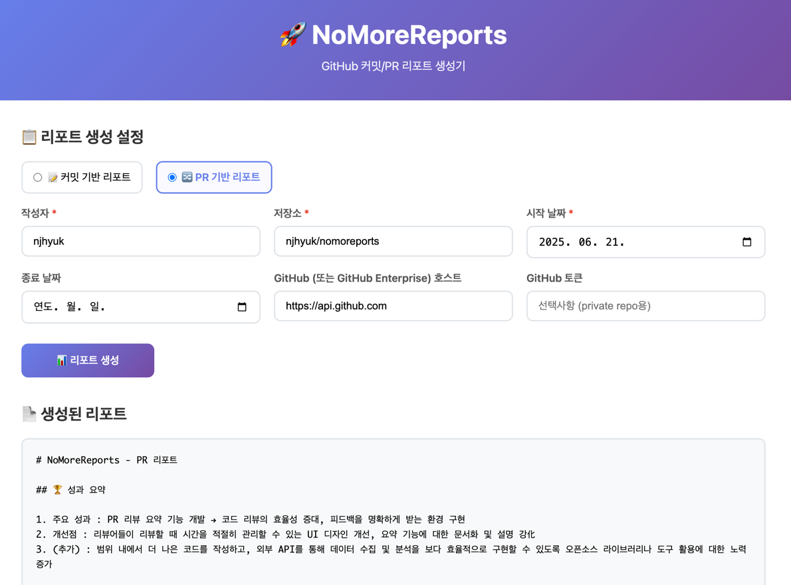

# 🚀 NoMoreReports - GitHub 커밋 리포트 생성기

GitHub 또는 GitHub Enterprise 저장소에서 특정 작성자의 커밋 메시지를 수집하고, 로컬 LLM을 통해 메시지를 분류한 후, 마크다운 리포트를 생성하는 웹 서비스입니다.



## 🚀 빠른 시작

```bash
# 저장소 클론
git clone https://github.com/njhyuk/nomoreports
cd nomoreports

# Docker Compose로 실행
docker-compose up -d

# 웹 브라우저에서 접속
open http://localhost:8080
```

## 🏗️ 기술 스택

- **Backend**: Kotlin + Spring Boot 3.5.3
- **Frontend**: HTML5 + CSS3 + JavaScript (Vanilla)
- **LLM**: Ollama (mistral)
- **API**: GitHub REST API v3
- **Container**: Docker + Docker Compose

## 📄 라이선스

MIT